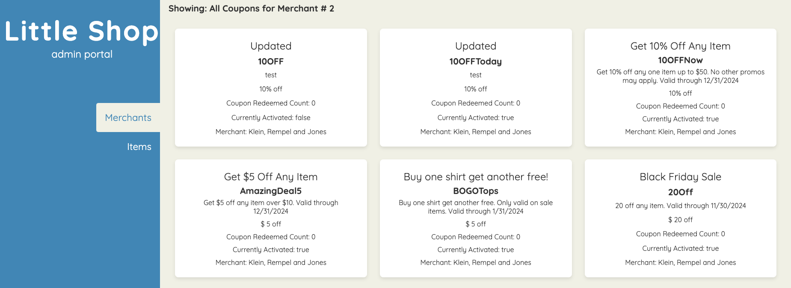

# Coupon Codes 

Link to your GitHub. Consider also providing LinkedIn link
  Github: https://github.com/devklynch

### Abstract:
This site shows an admin view for merchants and items. For this project, I updated the view coupons page to show the coupon information for the specified merchant.

### Installation Instructions:
You'll fork the repo and then Run npm install and then run npm run dev to ssee it running with "http://localhost:5173/"

### Preview of App:

### Context:
The project for both backend and frontend was assigned Thursday afternoon, so I had about 5-6 days to complete both. I spent about 2 days on the front end piece specifically.

### Learning Goals:
The goal was to complete the user story that when a user clicks on the View Coupons button for any given merchant, they should see a list of that merchant's coupons

### Wins + Challenges:
For the frontend specifically, it was challenge to understand where the data was coming from. It took some playing around with it and using the explore prompts to understand it. It helped to have the merchant's items view as comparison. I also enjoyed working through setting up what coupon information would show and imagine use cases as an admin user.
